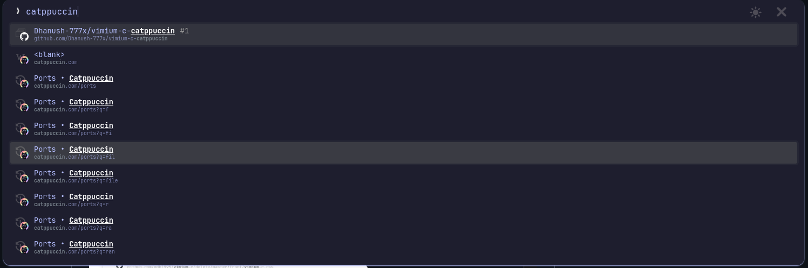

# vimium-c-catppuccin

Catppuccin mocha - lavendar theme for vimium c Chrome Extension

## Installation
- Go to vimium c extension options 
- Copy the contents of vimiumc.css file into Custom CSS for Vimium C UI text box

Enjoy :)
